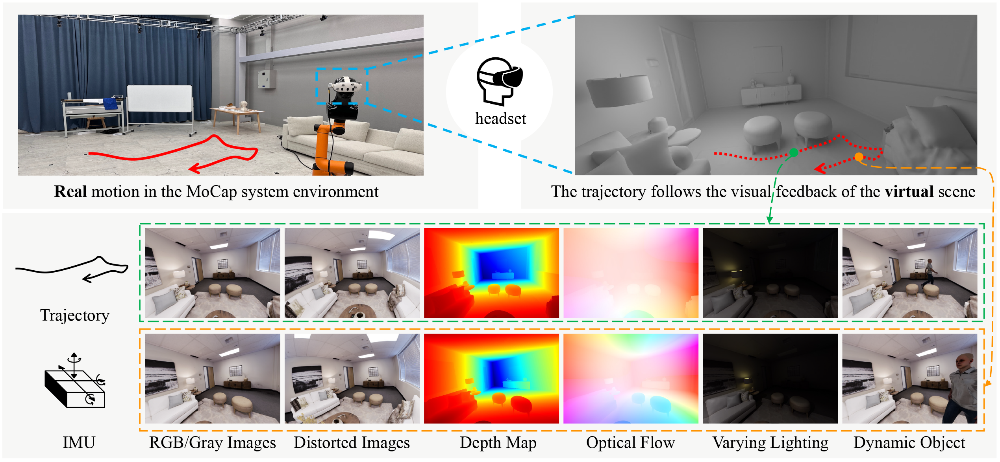

# semi-synthetic-vi-datasets



## Experiment Datasets

### Introduction

We select 8 single-floor scenes from the [**Replica dataset**](https://github.com/facebookresearch/Replica-Dataset) as our experimental examples. We first collect normal motion patterns for each virtual scene. Additionally, we sample a fast motion pattern for the four scenes `room0`, `room1`, `room2` and `hotel0` as they offer more space for movement compared to the other scenes. Based on our pipeline, we generate experimental datasets as follows.

| Scene   | Motion Pattern | Total Size (GB) | Length (m) | Duration (s) |
|---------|----------------|-----------------|------------|--------------|
| room0   | normal         | 4.52            | 27.5       | 60.1         |
| room0   | fast           | 4.56            | 33.9       | 57.3         |
| room1   | normal         | 4.51            | 28.4       | 59.7         |
| room1   | fast           | 4.88            | 39.5       | 60.7         |
| room2   | normal         | 3.81            | 23.3       | 49.4         |
| room2   | fast           | 3.70            | 30.4       | 48.0         |
| hotel0  | normal         | 5.18            | 27.7       | 61.5         |
| hotel0  | fast           | 4.92            | 35.2       | 55.6         |
| office0 | normal         | 4.74            | 23.8       | 53.2         |
| office2 | normal         | 4.22            | 26.0       | 55.2         |
| office3 | normal         | 3.72            | 25.5       | 53.0         |
| office4 | normal         | 3.79            | 30.2       | 53.4         |

### Download
- [OneDrive](https://1drv.ms/f/c/445199ecc992ee0f/EuCoHdRwLVlBlmODhxS_gKoBj_AEbFUaOIap-FoBl4AYXg?e=Uq2KJm), password: `ylab-xrpg`
- [Baidu Netdisk](https://pan.baidu.com/s/1coax-nFTkntwt3DWnCub-g), password: `ylab`

### Dataset Structure and Usage

The tree diagram after decompression of each dataset is as follows.
```
.
└── dataset/
    ├── calib_config.yaml
    ├── imu0.csv
    ├── imu_frame_gt_traj.txt
    ├── cam0/
    │   ├── rgb/
    │   ├── gray/
    │   ├── depth/  
    │   ├── forward_flow/
    │   └── distorted/
    └── cam1/
        ├── rgb/
        ├── gray/
        ├── depth/  
        ├── forward_flow/
        └── distorted/
```

The `calib_config.yaml` includes the intrinsic and distortion parameters of the left (cam0) and right (cam1) cameras, the calibration parameters of the IMU, as well as the extrinsic parameter between the camera and the IMU.

The `imu0.csv` file uses the format below: (timestamps=[ns], omega=[rad/s], alpha=[m/s^2])
```
timestamp,omega_x,omega_y,omega_z,alpha_x,alpha_y,alpha_z
1725613080543591683,  -0.0296705961227417,  -0.006981316953897476,  0.06283184885978699,  -0.12477071618395524,  8.680544902635967,  -4.841769075974278
...
1725613080578663683,  -0.04188790172338486,  -0.012217304669320583,  0.05235987901687622,  -0.10179201789773235,  8.504227870781067,  -4.53017923275055
```

The `imu_frame_gt_traj.txt` file uses the [TUM](https://cvg.cit.tum.de/data/datasets/rgbd-dataset/file_formats) format. You can obtain the ground truth trajectory of the camera frame using the extrinsic parameters between the camera and the IMU. In our system of 3D camera coordinates, the x-axis is pointing to the camera's right, the y-axis is pointing to the camera's downward, the z-axis is pointing to the camera's forward.

The `cam0` and `cam1` folders represent the left and right cameras, respectively, containing RGB images, grayscale images, depth maps and optical flow values under undistorted imaging conditions, as well as distorted images. 

- The depth maps are saved as the `.exr` format, and below is an example of how to read it:

    ```python
    import OpenEXR
    import Imath
    file = OpenEXR.InputFile(r'*.exr') 
    pt = Imath.PixelType(Imath.PixelType.FLOAT)
    dw = file.header()['dataWindow']
    size = (dw.max.x - dw.min.x + 1, dw.max.y - dw.min.y + 1)
    depth_map = np.frombuffer(file.channel('Depth', pt), dtype=np.float32).reshape(size[1], size[0])
    ```

- The `forward_flow` represents the optical flow values of the subsequent frame relative to the current frame, saved as 2-channel uint16 PNG images (similar to the [KITTI](https://www.cvlibs.net/datasets/kitti/eval_stereo_flow.php?benchmark=flow)). To convert the u-/v-flow into floating-point values, convert the value to float, subtract 2^15, and divide the result by 64:

    ```python
    flow_u = (I[:, :, 1].astype(np.float32) - 2 ** 15) / 64.0
    flow_v = (I[:, :, 2].astype(np.float32) - 2 ** 15) / 64.0
    ```

## Code
Coming soon.
